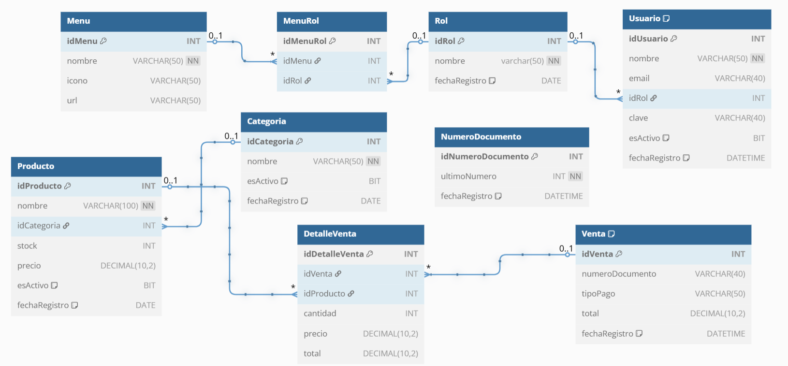
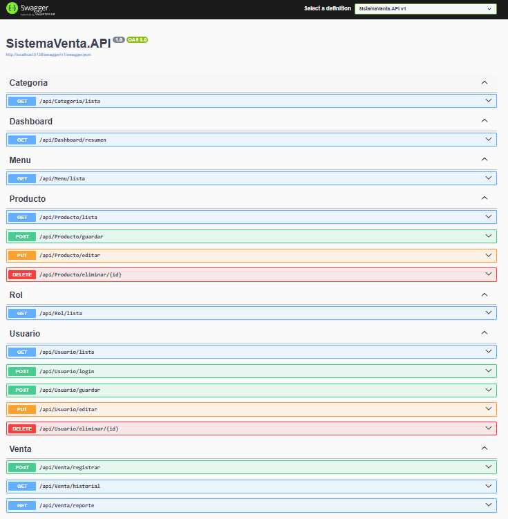

# 🛒 API Sistema de Ventas con ASP.NET Core 8

Este proyecto es una API RESTful desarrollada con ASP.NET Core 8, diseñada para gestionar un sistema de ventas eficiente y seguro. Se ha estructurado utilizando la arquitectura N-Capas, asegurando un código limpio, modular y escalable. Además, se ha integrado JWT para autenticación y autorización por roles, junto con un interceptor para manejar automáticamente las solicitudes protegidas.

## 🚀 **Características Principales**

### **Autenticación y Autorización con JWT**
- Implementación de **JSON Web Tokens (JWT)** para la gestión de autenticación segura.
- Restricción de acceso a ciertos endpoints según el **rol del usuario** (Administrador, Empleado, etc.).

### **Estructura del Sistema**
📂 **SistemaVenta.API** → Contiene los **controladores** y configuraciones principales de la API.  
📂 **SistemaVenta.BLL** → Capa de Negocios: Implementa la **lógica de negocio** (servicios y validaciones).  
📂 **SistemaVenta.DAL** → Capa de Datos: Acceso a datos mediante **repositorios** y conexión con la base de datos.  
📂 **SistemaVenta.DTO** → Define los **objetos de transferencia de datos** usados entre capas.  
📂 **SistemaVenta.Model** → Capa Modelo: Contiene los **modelos de datos** del sistema.  
📂 **SistemaVenta.Utility** → Funciones y herramientas auxiliares para distintas operaciones.  
📂 **SistemaVenta.IOC** → Configuración de la **inyección de dependencias**.  

## 🔑 **Seguridad y Gestión de Usuarios**
✔ Implementación de **JWT** con validación de credenciales.  
✔ Restricción de endpoints con `[Authorize]`, asegurando que solo los usuarios con el **token correcto** puedan acceder.  
✔ Configuración de **roles y permisos**:
   - **Administrador**: Puede realizar todas las acciones (crear, editar, eliminar, listar).  
   - **Empleado**: Solo tiene permisos restringidos para ciertas operaciones.  

## 🔧 **Mejoras y Optimización**
✅ **Código limpio y estructurado** con **inyección de dependencias** para facilitar el mantenimiento.  
✅ **Optimización del rendimiento** con el uso de **consultas eficientes** en la base de datos.  
✅ **Seguridad reforzada** evitando exponer información sensible en las respuestas de la API.  

ℹ️ <strong>NOTA IMPORTANTE:</strong> Recuerda que este paso es crucial.
> Reemplazar la `Cadena de Conexión` a la `Base de Datos`, en el archivo `appsettings.json`.